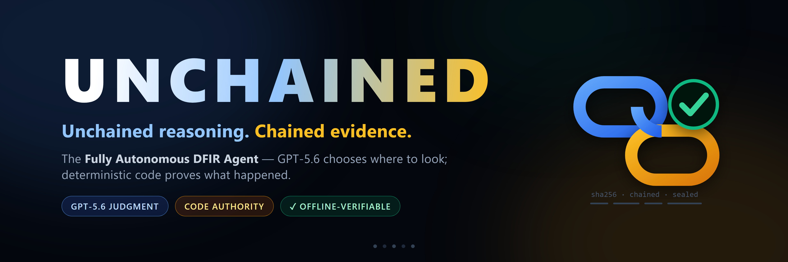
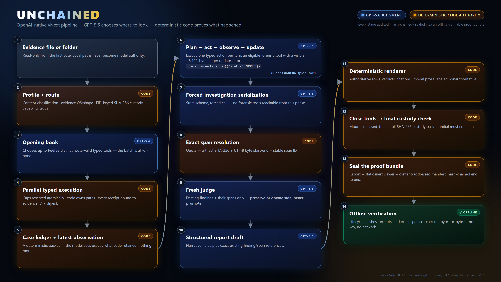
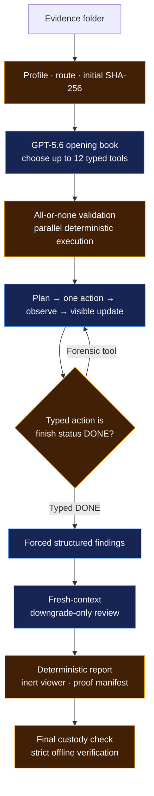

<p align="center">
  
</p>

<p align="center">
  
  
  
</p>

<p align="center">
  <a href="LICENSE"></a>
  
  
  
  
  
  
  
</p>

<p align="center">
  <strong>Unchained reasoning. Chained evidence.</strong>
</p>

<p align="center">
  A bounded autonomous Digital Forensics &amp; Incident Response (DFIR)
  investigator: model judgment where it helps, deterministic authority
  everywhere evidence can change.
</p>

<p align="center">
  <a href="docs/START-HERE.md"><strong>🚀 Start here</strong></a> ·
  <a href="#for-judges--the-submission-at-a-glance">🏆 For judges</a> ·
  <a href="#quickstart">⏱️ Quickstart</a> ·
  <a href="#what-you-will-see">🎬 Run experience</a> ·
  <a href="#how-it-works">🧠 Architecture</a> ·
  <a href="#proof-status">🧾 Proof status</a> ·
  <a href="JUDGE-QUICKSTART.md">⚖️ Judge guide</a>
</p>

**The whole idea in one breath:**

- 🔍 **Deterministic code goes first** - before any model call, the evidence is
  enumerated, content-probed, routed, and SHA-256-hashed into custody, locally
  and read-only. Zero OpenAI calls until this front door is green.
- 🧠 **Then GPT-5.6 runs the investigation** - it opens with up to twelve
  high-value typed forensic tools (memory and disk) fired in parallel, reads
  the retained results, chooses the next tool one audited action at a time, and
  finally proposes structured findings that a fresh-context reviewer may only
  preserve or downgrade.
- 🔒 **Code owns the evidence the whole way** - read-only access, hard caps,
  all-or-none validation, exact byte-span citations. The model is never
  allowed to *be* the evidence.
- 🧾 **Every case seals into a proof bundle** - a hash-chained audit log and an
  offline verifier that rebuilds the report and viewer byte-for-byte. If one
  byte changes, verification fails.

**The real first screen is one word** - just `sentinel`: no key, no evidence,
zero OpenAI calls. It welcomes you, asks where the evidence is, and prints a
local SHA-256 case card before any model is involved.

> [!IMPORTANT]
> **What “proves” means here:** code verifies what ran, what bytes were retained,
> what exact text was cited, and whether custody still matches. It does **not**
> prove that a model's forensic interpretation is true. A human analyst still
> owns that judgment.

> [!TIP]
> **New analyst? There is exactly one command:** `sentinel`
>
> It opens the welcome, asks one thing (where the evidence is), prints a local
> SHA-256 case card, stops at one launch card
> (`1 = quick Terra test · 2 = full Terra run · 3 = qualifying Sol · Q = quit`), and then one final key step
> (Enter = use the saved key, or paste a new one at a hidden prompt) before any
> spend. No flags, no environment variables. Follow the card-by-card
> [first-case guide](docs/START-HERE.md).

## For judges - the submission at a glance

| Field | Value |
|---|---|
| Track | **Developer Tools** - OpenAI Build Week |
| Built with | **Codex** (implementation + adversarial review) and **GPT-5.6** (Sol investigator/reviewer, Terra rehearsal/smoke) |
| Codex Session ID | `019f61e5-5755-7a02-adb4-618d32baab27` - see [Built with Codex](#built-with-codex) |
| Fastest no-key test | Two-command install, then `sentinel verify examples/public-run-complete` → **VALID**. A real GPT-5.6 Sol `COMPLETE` run, zero spend ([judge quickstart](JUDGE-QUICKSTART.md)) |
| Shipped `COMPLETE` proof | [`examples/public-run-complete`](examples/public-run-complete) - an authentic GPT-5.6 **Sol** `COMPLETE` bundle **inside this repo**: **4 findings** (1 CONFIRMED, 2 NEEDS-REVIEW, 1 UNSUPPORTED), fresh-judge verdicts, and a sealed report on the public DC01 domain-controller case - a full live investigation for **~$2.92 in 9m39s**; passes strict `--require-complete --require-live-gpt56` (37 artifacts, 194 audit entries) |
| Also shipped | [`examples/public-run-partial`](examples/public-run-partial) - a `gpt-5.6-luna` bundle: 14/14 typed tools on real memory, honest `PARTIAL` at the hard cap |
| Live receipts | [Sol capped opening receipt](docs/runs/sol-capped-dc01-opening.json) · [Luna canary](docs/runs/luna-canary-receipt.json) |
| One-page judge brief | [submission/JUDGE-ONE-PAGER.md](submission/JUDGE-ONE-PAGER.md) |
| Honest gaps | The demo video is still pending; the [proof status](#proof-status) table never overstates |

**Where each judging criterion lives:**

| Criterion | Look at |
|---|---|
| Technological Implementation | [How it works](#how-it-works) · typed opening book, stateless loop, typed `DONE` v2, byte-exact offline verifier |
| Design | one-word `sentinel` self-driving front door · live investigation narration · static inert proof viewer |
| Potential Impact | [Why Unchained is different](#why-unchained-is-different) - inspectable autonomy for any high-consequence agent, not just DFIR |
| Quality of the Idea | The authority split: the model chooses strategy; code owns evidence, execution, citations, custody, and the report |

**🚦 Submission readiness - live and honest:**

| Item | Status |
|---|---|
| 🟢 Public MIT repo, Codex Session ID, provenance boundary | **Done** |
| 🟢 378-test offline gate, ruff clean, hardened Docker | **Done** |
| 🟢 Live GPT-5.6 Sol opening on real 2 GiB Windows memory | **Done** - retained, capped `PARTIAL` by design |
| 🟢 Authentic GPT-5.6 bundle **ships in the repo** and verifies `VALID` offline | **Done** - [`examples/public-run-partial`](examples/public-run-partial): 14/14 typed tools, honest `PARTIAL` at the hard cap |
| 🟢 Zero-key guided onboarding + colorful live run experience | **Done** - see the screen above |
| 🟢 Authentic `COMPLETE` proof bundle **ships in the repo** and passes strict verify | **Done** - [`examples/public-run-complete`](examples/public-run-complete): Sol, real findings + judge + report, `--require-complete --require-live-gpt56` VALID (37 artifacts, 194 audit entries) |
| 🟡 Public sub-3-minute video | **In progress** - recorded against the real bundle |
| ⚪ Same-evidence competitive benchmark | **Deliberately cut** - no unmeasured claims |

## Quickstart

### ⏱️ 60 seconds, any OS, zero keys, zero spend

```powershell
# 🪟 Windows (one line - installs, walks you in, never spends)
irm https://raw.githubusercontent.com/3sk1nt4n/Unchained/main/get.ps1 | iex
```

```bash
# 🐧 Linux / 🍎 macOS (one line - hardened container, never spends)
curl -fsSL https://raw.githubusercontent.com/3sk1nt4n/Unchained/main/get.sh | bash
```

**Ready-made samples, no hunting:** a safe synthetic case ships in the repo
(run `sentinel` and point it at the bundled `docker/fixtures` folder for an
instant, free `$0` preview), and the installer walks you to the public
**DFIR Madness 001** practice case (official download page plus the publisher's
checksums; Unchained never fetches evidence for you).

Point it at a folder and you get a local, cryptographic case card - every file
SHA-256-hashed, classified, and routed **before any model is allowed near it**.
The tool refuses to overstate: a synthetic logs-only fixture honestly gets an
amber `ACTION NEEDED` card, not a fake green light.

### 🧾 Verify a real GPT-5.6 investigation in your first minute

Two authentic retained GPT-5.6 bundles **ship in this repository**. After
either install above, run:

```powershell
sentinel verify examples\public-run-complete   # → VALID · 37 artifacts · 194 audit entries (COMPLETE)
sentinel view   examples\public-run-complete   # inert, no-JS proof viewer
sentinel verify examples\public-run-partial    # → VALID · 20 artifacts · 62 audit entries (PARTIAL)
```

`public-run-complete` is a real GPT-5.6 **Sol** investigation of the public DC01
case: real findings, a fresh-judge pass, and a sealed report, verifying under the
strict `--require-complete --require-live-gpt56` gate. `public-run-partial` is a
`gpt-5.6-luna` opening on a real 2 GiB Windows memory image, honestly `PARTIAL` at
the hard cap. Both are custody-checked and re-verified on **your** machine with no
key and no network.

**Pick your machine. Every lane starts with zero keys and zero spend.**

| Your machine | Lane | First result in | Spend | Verified state |
|---|---|---|---|---|
| 🪟 **Windows 10/11** | Native CPython 3.11 - the flagship forensic lane | ~5 min | $0 until you pick a package on the launch card and pass the key step | ✅ Tested; the live Sol `COMPLETE` run happened here |
| 🐧 **Linux (AMD64)** | Hardened Docker offline lane | ~3 min | $0 | ✅ Same 378-test suite in-container (a few Windows-only tests skip) |
| 🍎 **macOS** | Same Docker lane via Docker Desktop | ~3 min | $0 | ⚠️ Expected via Docker's `linux/amd64` emulation; not yet verified on Mac hardware |

Every lane converges on the same experience: a colorful guided onboarding, a
SHA-256 case card, one launch card, and after a run an
offline-verifiable proof bundle.

### Two commands. Any OS.

The first installs and verifies everything; the second walks you through a whole
case. Pick your line:

```powershell
# 🪟 Windows (Git + CPython 3.11)
git clone https://github.com/3sk1nt4n/Unchained.git; cd Unchained
.\setup.ps1          # install + verify everything (one command)
.\unchained.ps1      # start a whole case - it walks you through the rest
```

```bash
# 🐧 Linux (Git + Python 3.11) - macOS: use the Docker lane below (tested route)
git clone https://github.com/3sk1nt4n/Unchained.git && cd Unchained
./setup.sh           # install + verify everything (one command)
./unchained.sh       # start a whole case - it walks you through the rest
```

> Prefer a one-liner install? `irm …/get.ps1 | iex` (Windows) or
> `curl -fsSL …/get.sh | bash` (Linux/macOS) do the clone + install for you.
> After install, bare `sentinel` is identical to the launcher; re-verify anytime
> with `.\setup.ps1 -Check` (or `./setup.sh --check`).

**What the second command does** (identical on every OS): a full-color welcome,
**one question** (where the evidence is), a SHA-256 verified case card computed
locally (`$0`, no key, no OpenAI), one launch card
(`1 = quick Terra test · 2 = full Terra run · 3 = qualifying Sol · Q = quit`), and then the ONE final key
step before the pipeline starts: Enter uses the saved key, or a hidden paste
replaces it right there.

**Answering the one question** is a card with two easy routes:

- 🧪 **No evidence yet?** Type **`D`** at the case prompt (or pick option 1
  in the `get.ps1` menu) for the guided **public DC01 practice case**: the two
  direct download links open in your browser
  ([DC01-memory.zip](https://dfirmadness.com/case001/DC01-memory.zip) +
  [DC01-E01.zip](https://dfirmadness.com/case001/DC01-E01.zip)), the publisher
  MD5s are verified, and the case folder is prepared for you.
- 📁 **Your own case?** ONE folder = ONE case = ONE host - at most one ready
  memory image (`.raw`/`.mem`/`.vmem`/`.dmp`) plus at most one disk image
  (`.E01`/`.dd`/raw); two of the same kind fail closed. `.zip` archives are
  welcome - the flow offers to extract them locally and re-profiles
  automatically. Original evidence bytes never leave the machine
before it runs live and verifies the sealed bundle. No flags, no environment
variables. Depth (option 2) sets only hard stop ceilings; the same GPT-5.6 Sol
investigator runs either way:

| Depth | Hard ceilings (not a price quote) |
|---|---|
| **LIGHT** - first case | 20 tools · 100,000 tokens · 10 min · $2.50 estimated cost |
| **HEAVY** - deeper run | 60 tools · 400,000 tokens · 30 min · $10 estimated cost |

Read the concise [Start Here guide](docs/START-HERE.md) for evidence formats,
mount outcomes, cloud boundaries, and the post-run verify/view steps.

**Zero-install, fully isolated** (any OS with Docker): the hardened container
reads no evidence, takes no key, and has **no network** - 

```bash
docker compose run --rm offline
```

It profiles a committed synthetic fixture with zero OpenAI calls (public evidence
ID `E001`, matching custody), runs non-root with a read-only filesystem and every
Linux capability dropped, and honestly reports `logs-only`.

> [!NOTE]
> **Honest macOS label:** the container is the same hardened `linux/amd64` image
> running under Docker Desktop through emulation. It has not been verified on
> Mac hardware, and emulation makes large-image work slower - same container,
> same commands, not yet a tested macOS forensic route.

### 💡 Cheap live check: one GPT-5.6 Terra request

This canary tests only container → OpenAI authentication, the Responses API,
returned model/request identity, usage accounting, and one forced strict typed
tool call. It reads no evidence and creates no proof bundle.

Put the key in a one-line file outside the repository, then point Compose to
that file:

> Revoke any key that has appeared in chat, logs, screenshots, or recordings.
> Use a fresh project-scoped key with an explicit spend limit for the canary.

```powershell
$env:OPENAI_API_KEY_FILE = "C:\Secure\openai_api_key"
docker compose --profile live run --rm live-smoke
```

The key is mounted as a Docker secret and read through
`OPENAI_API_KEY_FILE`; it is not copied into the image or placed in ordinary
container environment metadata. The command defaults to `gpt-5.6-terra`, one
request, low reasoning, low verbosity, a 128-output-token ceiling, `store=false`,
and no retry layer.

> The result is labeled `NONQUALIFYING_CONNECTIVITY_SMOKE`. It cannot satisfy
> `--require-live-gpt56`, enter a competitive benchmark, or stand in for a forensic
> run. Terra is used here as this project's cheaper GPT-5.6 rehearsal tier;
> the proof-compatible investigation remains Sol-specific. See OpenAI's [latest-model guide](https://developers.openai.com/api/docs/guides/latest-model)
> and [current pricing](https://developers.openai.com/api/docs/pricing).

The first live canary has now been independently reported as one valid Luna
request with 186 input and 27 output tokens. Because its raw JSON receipt was
not retained with the supplied artifacts, the committed
[Luna receipt](docs/runs/luna-canary-receipt.json) is explicitly an attested
sanitized projection - not bundle-derived cryptographic proof.

<details>
<summary>Linux/macOS secret-file command</summary>

```bash
export OPENAI_API_KEY_FILE=/secure/openai_api_key
docker compose --profile live run --rm live-smoke
```

</details>

### 🔬 Real investigation: the GPT-5.6 Sol proof path

The flagship path is native Windows + CPython 3.11 for Windows memory evidence.
After `setup.ps1`, it is the **same one command** - `sentinel` defaults to the
public `gpt-5.6` alias (Sol) automatically, so there is nothing to configure:

```powershell
sentinel
```

It profiles the case, stops at one launch card
(`1 = quick Terra test · 2 = full Terra run · 3 = qualifying Sol · Q = quit`), and then asks the final key
step (Enter = saved key, or a hidden paste) before spending. At completion
it prints the exact next `verify` and `view` commands. Advanced automation may
still invoke `sentinel run` directly when authorization is established outside
the CLI.

The full flagship `COMPLETE` run is now demonstrated on real memory: a GPT-5.6
Sol + HEAVY investigation of the public DC01 case ran the typed
`finish_investigation({"status":"DONE"})` → serializer → fresh judge →
final-report phases to a sealed bundle that passes strict verification. It ships
at [`examples/public-run-complete`](examples/public-run-complete). To rehearse
cheaply first, run a harmless case on the rehearsal model before spending on Sol.

## What you will see

1. **Case card** - evidence is classified by bounded content probes, assigned
   public IDs, routed by OS/shape, and SHA-256 hashed before any model call.
2. **Opening book** - GPT-5.6 chooses up to twelve eligible typed tools. Code
   validates the complete decision and runs them concurrently; the terminal
   narrates each tool with its retained bytes and execution time.
3. **Visible investigation** - each adaptive turn is
   `PLAN → one ACT → OBSERVE → UPDATE`. The run shows GPT-5.6's per-turn
   reasoning (its visible case-ledger update), the one typed action it chose,
   and per-response token counts with a running cost estimate; growing provider
   transcripts are never replayed.
4. **Grounded review** - exact quotes become content-addressed UTF-8 byte spans;
   a fresh-context reviewer may preserve or downgrade, never upgrade, and each
   verdict prints as a green *preserved* or amber *downgraded* line with its
   rationale.
5. **Result tables and proof handoff** - the closing panel prints the
   authoritative findings table (ID, severity, final judge status, title - 
   the same deterministic rows the sealed report renders), then direct paths
   to every promised artifact (`viewer.html`, `audit.jsonl`, `tool-outputs/`
   with its count, `summary.json`), the terminal status badge, the strict
   verification gates, and the exact verify/view commands.

The model never receives a shell, local evidence path, executable name,
subprocess authority, or budget authority. Fixed private workers may invoke
allowlisted forensic operations; the model cannot construct those commands.

## What you get

Every finalized run lives under
`unchained-runs/<UTC-timestamp>-<id>/` outside the evidence tree.

| Artifact | Plain-English purpose |
|---|---|
| `viewer.html` | Self-contained, no-JavaScript proof viewer; no server required |
| `report.md` | Human-readable report with deterministic finding rows and citations |
| `audit.jsonl` | Ordered, hash-chained lifecycle receipts |
| `tool-outputs/` | Exact sanitized outputs cited by findings |
| `profile.json` | Evidence inventory, route, readiness, and capability label |
| `environment.json` | Allowlisted runtime, dependency, model, prompt, catalog, and cap facts |
| `summary.json` | Audit-derived status, usage, finding, receipt, and custody counters |
| `manifest.json` + `manifest.sha256` | Content-addressed bundle inventory and detached checksum |

```powershell
sentinel view C:\path\to\bundle
```

`view` verifies the bundle before opening it. A bundle claiming `COMPLETE`
automatically receives strict lifecycle verification first.

## Who needs this

An incident-response consultancy wants AI triage on a compromised host image,
but must show the client - and possibly a regulator or opposing counsel - 
exactly what the AI did to the evidence. A transcript is not an answer.
Unchained gives them a sealed bundle: which tools ran, on which evidence, with
which SHA-256 identities, what exact bytes each finding cites, and a verifier
anyone can run offline to confirm none of it changed. The same need appears
wherever an autonomous agent touches something that can end up in a dispute:
security testing, compliance review, financial operations. The audience is
anyone who wants model autonomy **and** has to answer for it afterward.

## Why not just guardrails, evals, or attestation?

Each existing trust family solves a different problem, and none closes this one:

- **Guardrails / structured outputs** constrain what the model may *say* in one
  response. They do not bind a multi-step investigation to retained evidence
  bytes, and nothing re-checks the transcript afterward.
- **Evals and LLM-as-judge** measure quality offline or ask a second model for
  an opinion. Unchained's reviewer is deliberately weaker and therefore
  stronger: it can only **preserve or downgrade** existing findings - a
  monotonic review lattice, not a second opinion that can invent support.
- **Supply-chain attestation (in-toto/SLSA-style)** proves how software was
  built. Unchained applies the same content-addressed discipline to what an
  *agent did at runtime*: every tool call, output byte, citation span, custody
  hash, and report row is reconstructed and byte-compared by an independent
  offline verifier.

The delta in one sentence: **existing tools constrain or score the model;
Unchained makes the investigation itself independently re-checkable.**

## Why Unchained is different

| Layer | Authority |
|---|---|
| GPT-5.6 investigator | Chooses bounded strategy, updates the visible ledger, interprets retained observations, proposes findings |
| Deterministic controller | Routes evidence, validates typed calls, enforces caps, executes tools, hashes custody, resolves exact spans |
| Fresh-context reviewer | Preserves or downgrades existing findings; cannot create or upgrade them |
| Deterministic renderer | Owns authoritative finding rows, transitions, citations, status, report, and viewer |
| Offline verifier | Reconstructs phase inputs, receipts, spans, costs, report, viewer, custody, and terminal state |
| Human analyst | Decides whether the interpretation is correct and what action to take |

That separation is the product: **GPT-5.6 decides where to look; deterministic
code controls what is legal and proves what the system actually retained and
cited.**

## How it works

<p align="center">
  
</p>



- **Blue:** GPT-5.6 judgment inside a bounded protocol.
- **Amber:** deterministic code authority and proof reconstruction.

**Invocation budget:** a completed case makes exactly **4 fixed GPT-5.6
requests** (opening book, findings serialization, fresh review, report draft)
**plus one per adaptive action** - minimum five, never an unbounded loop. Every
request is audited and charged before use, and the hard caps fire *before*
dispatch, ending the run as honest `PARTIAL` instead of overspending. Details:
[Model invocation budget](docs/ARCHITECTURE.md#model-invocation-budget).

Read the full [architecture](docs/ARCHITECTURE.md) or the detailed
[OpenAI vNext review](docs/OPENAI_VNEXT_REVIEW.md).

## Current release status

| Capability | State |
|---|---|
| OpenAI-native controller and independent offline verifier | ✅ Verified offline |
| Linux/AMD64 Docker build, 378-test suite, CLI, profile, and custody | ✅ Verified locally |
| Cheap GPT-5.6 typed-tool canary (run live on Luna; the smoke lane now defaults to Terra) | ✅ Demonstrated live; second-reviewer-attested (project-affiliated) sanitized receipt |
| Authentic GPT-5.6 Sol capped opening on real Windows memory | ✅ Sanitized receipt committed; `VALID` recorded at creation; terminal state intentionally `PARTIAL` |
| Shipped verifiable GPT-5.6 bundle in this repo | ✅ [`examples/public-run-partial`](examples/public-run-partial): `gpt-5.6-luna`, 14/14 typed tools, custody match, verifies `VALID` on current code |
| Authentic `COMPLETE` GPT-5.6 Sol evidence bundle | ✅ Shipped at [`examples/public-run-complete`](examples/public-run-complete): real findings, fresh judge, sealed report; strict `--require-complete --require-live-gpt56` VALID (37 artifacts, 194 audit entries) |
| Same-evidence speed/cost/accuracy comparison | ⚪ Out of scope for Build Week - no comparative claims are made |

**Live milestones - two authentic GPT-5.6 runs on the same public 2 GiB Windows
memory image are retained.** The newest **ships in this repository** at
[`examples/public-run-partial`](examples/public-run-partial): `gpt-5.6-luna`
across 4 responses chose and ran **14 typed Volatility tools** (all success),
custody matched, and the run stopped honestly at its hard tool budget
(`MAX_TOOL_CALLS: reservation would reach 14 > 13`) after 55.5 seconds and
180,285 provider-reported tokens (~$1.16 local estimate).
`sentinel verify examples/public-run-partial` returns **VALID** - 20 artifacts,
62 hash-chained audit entries - on any fresh clone, no key required. The
earlier run recorded `gpt-5.6-sol` on both responses and executed all six
model-selected opening tools under the then six-tool cap in 43.702 seconds
(59,254 tokens, $0.38789875 local estimate); its sanitized receipt is committed
at [docs/runs/sol-capped-dc01-opening.json](docs/runs/sol-capped-dc01-opening.json)
with `VALID` recorded at creation. These prove the live opening, typed
execution, cap, custody, and bundle path - not a completed investigation. See
the [release handoff](docs/OPENAI_VNEXT_RELEASE_HANDOFF.md) for the full
scorecard and fastest submission path.

**Post-rehearsal hardening:** four later unscored attempts exposed a real
terminal-contract problem. Their retained audits show completed responses with
395–1,750 characters of visible ledger text but no typed action - not empty
responses. The v2 controller therefore does not normalize blank text,
punctuation, Markdown, or prose into completion. Every adaptive response must
choose exactly one typed action: one eligible forensic tool or the closed
`finish_investigation` action with the sole argument `status="DONE"`. The
offline verifier understands historical literal-DONE-v1 bundles but requires
the new runtime's typed catalog, `tool_choice=required`, and exact terminal
schema. A live `COMPLETE` v2 bundle now ships at
[`examples/public-run-complete`](examples/public-run-complete) and passes strict
verification.

## Proof status

| Claim | Current evidence |
|---|---|
| Deterministic profile, routing, public IDs, and pre/post custody | Unit/adversarial tests + containerized synthetic profile |
| Up-to-twelve all-or-none parallel opening | Controller and synchronization-barrier regression tests |
| Stateless one-action adaptive loop and typed `DONE` | Required-action, closed-schema, malformed-status, exact-input, and protocol-mutation tests; literal v1 remains verifier-readable only |
| Exact evidence spans | Full-artifact late-span and byte-mutation tests |
| Downgrade-only fresh review | Finding-ID, status-lattice, span, and receipt tests |
| Deterministic report and inert viewer | Independent rerender + exact-byte and positive HTML/CSP policy tests |
| Independent strict verifier | Re-chained adversarial mutations across lifecycle, usage, retry, cost, and custody |
| Linux Docker packaging | CPython 3.11 test target: the same 378-test suite (a few Windows-only tests skip on Linux), Ruff, format, and `pip check`; non-root runtime/profile gate |
| Live GPT-5.6 canary (Luna at the time; the smoke lane now runs Terra) | Independently demonstrated; [attested sanitized projection](docs/runs/luna-canary-receipt.json), with no raw receipt available for bundle proof |
| Authentic GPT-5.6 Sol opening on real memory | [Bundle-derived sanitized receipt](docs/runs/sol-capped-dc01-opening.json): 2 model responses, 6 successful opening tools, recorded custody match, `VALID` recorded at creation |
| Shipped GPT-5.6 bundle in this repo | [`examples/public-run-partial`](examples/public-run-partial): 4 responses, 14 successful typed tools, custody match, verifies `VALID` on current code (20 artifacts, 62 audit entries) |
| Authentic complete GPT-5.6 Sol case | ✅ [`examples/public-run-complete`](examples/public-run-complete): Sol + HEAVY `COMPLETE`, 4 findings, judge verdicts, sealed report, strict-VALID (~$2.92, 9m39s, 20 turns, 31 tools, 395,555 tokens) |
| Faster/better than a competitor baseline | Architectural thesis only until the frozen benchmark is run |

The verifier establishes local protocol and bundle consistency. It does not
cryptographically authenticate OpenAI, replace semantic accuracy scoring, or
turn a same-family reviewer into external ground truth.

## Inspect a proof bundle without a key

```powershell
sentinel verify C:\path\to\bundle --require-complete --require-live-gpt56
sentinel view C:\path\to\bundle
```

Strict verification does more than recompute manifest hashes:

- it reconstructs every model-visible phase packet and typed-call contract;
- it resolves finding quotes against retained artifacts and exact UTF-8 ranges;
- it recomputes usage, local cost estimates, lifecycle counts, and custody;
- it rebuilds `report.md` and `viewer.html` and requires byte-for-byte equality.

Offline consistency is not provider authenticity. Preserve provider-side logs
and externally anchor the final checksum if that threat model matters.

## Supported paths

| Evidence / host route | Status |
|---|---|
| Windows memory image on native Windows | Live Sol + HEAVY `COMPLETE` case demonstrated: opening, adaptive loop, findings, fresh judge, sealed report, strict-VALID |
| Raw memory image in the safe Linux container | Supported by Volatility; case-specific symbols/readiness still apply |
| Raw disk image with Sleuth Kit in the safe container | Unprivileged raw inspection available |
| Mounted E01/NTFS/APFS inside Docker | Not enabled; would require elevated device/FUSE authority |
| Windows disk/E01 on a properly configured native host | Implemented; authentic vNext route pending |
| Linux evidence | Experimental |
| macOS evidence | Best effort |
| Logs-only folder | Profile/custody smoke only; not a complete investigation route |
| Two ready memory images or two ready disk images | Fails closed; split them into separate cases |

Evidence capability is route-specific. “Docker runs on this laptop” is not the
same claim as “every forensic image type is fully supported on this host.”

## Docker safety boundary

The default Compose service is intentionally conservative:

- non-root UID/GID `10001:10001`;
- read-only root filesystem and read-only evidence bind;
- all Linux capabilities dropped;
- `no-new-privileges` and bounded process count;
- no Docker socket, host PID namespace, or privileged mode;
- no network for the offline service;
- Git exists only in the networked builder, not the final runtime;
- `sleuthkit`, Volatility, CA certificates, and Tini in the runtime.

The live canary necessarily has outbound network access. Safe Docker mode does
not mount filesystems: E01/FUSE/loop-device support would weaken isolation and
is deliberately outside this default.

For multi-gigabyte evidence on Docker Desktop, use a local non-OneDrive path or
WSL2 ext4 storage. A cloud-synced bind can dominate runtime.

## CLI at a glance

```text
sentinel                              # the one command: self-drives a whole case
sentinel onboard [<evidence>] [--mount] [--json]   # $0 preview / scripting surface
sentinel key [--status | --remove]
sentinel doctor
sentinel profile <evidence> --json
sentinel smoke-openai --json
sentinel run <evidence> --caps strict              # advanced non-interactive entry
sentinel verify <bundle> --require-complete --require-live-gpt56
sentinel view <bundle>
```

Bare `sentinel` on a terminal walks you through everything (welcome → one
question → verified card → one launch card → final key step). The subcommands
above remain for `$0` previews, scripting, and advanced non-interactive runs.

| Exit | Meaning |
|---:|---|
| `0` | Command completed within its policy; not an accuracy guarantee |
| `1` | Fatal runtime, provider, verification, or custody failure |
| `2` | Invalid input or configuration |
| `3` | `PARTIAL`: a cap or mandatory phase failed safely |

## Performance and recommended hardware

All GPT-5.6 compute runs on OpenAI's side - **no local GPU is used or
required**. Local performance is decided by CPU, RAM, and the disk path:

| Component | Minimum | Recommended | Why it matters |
|---|---|---|---|
| CPU | 4 cores / 8 threads | 8+ cores | The opening fires up to **twelve typed tools**, executed in bounded concurrent waves, each in its own private child process |
| RAM | 8 GB | **16 GB** | Several Volatility processes read the same multi-GiB memory image at once; 16 GB keeps the opening out of swap (the OS page cache shares the image bytes) |
| Disk | SSD, local path | NVMe, non-synced folder | Full SHA-256 custody hashing plus parallel image reads; a OneDrive/cloud-synced or network path can dominate total runtime |
| GPU | none | none | Model inference is an OpenAI API call, not local |
| Network | stable HTTPS egress | - | Used only for GPT-5.6 requests; evidence bytes never leave the machine |

**Measured reference point** (retained live run, Windows 11): a 2 GiB Windows
memory image, six-tool concurrent opening, 43.7 seconds end to end. Rows above
are sizing recommendations, not measurements.

For the Docker Desktop lane with multi-gigabyte evidence, give WSL2 enough
headroom and keep evidence on WSL2 ext4 (not a Windows OneDrive bind):

```ini
# %UserProfile%\.wslconfig - then run: wsl --shutdown
[wsl2]
memory=12GB
processors=6
```

## Troubleshooting

| Symptom | What to do |
|---|---|
| `doctor` says model/key missing | Run `sentinel key` to save your key (the model already defaults to `gpt-5.6`; `OPENAI_API_KEY`/`OPENAI_API_KEY_FILE` also work) |
| Docker `doctor` exits `2` with no key | Expected for the offline/no-secret service; use `profile` or `--help` for the no-key gate |
| Terra smoke cannot find its secret | Set host `OPENAI_API_KEY_FILE` to a readable one-line file and add `--profile live` |
| Profile says mount unavailable | Use raw inspection or a properly configured native forensic host; do not add `--privileged` casually |
| Multiple same-class images fail | Put each ready memory/disk image in a separate case folder |
| `view` cannot open from Docker | Verify in the container, then open the bind-mounted `viewer.html` on the host |
| A run is `PARTIAL` | Read `summary.json`, `report.md`, and the last audit events; do not relabel it complete |
| `PARTIAL` with a `429 Request too large ... TPM` audit error | The findings-serializer re-sends every retained observation in one request, which can exceed a low tokens-per-minute limit. New OpenAI accounts cap at ~200k TPM; a rich 12-tool investigation's serializer can be ~270k. Use an account whose TPM exceeds your serializer size (add credit / verify to tier up), or run a smaller opening. |
| `PARTIAL` with `MAX_TOTAL_TOKENS` before the report | The shipped COMPLETE run finished within the stock HEAVY ceilings ($2.92 of $10, ~395,555 of 400,000 tokens), so the defaults can carry a full lifecycle. A richer or longer run can still hit the cap; optional headroom overrides exist, e.g. `MAX_TOTAL_TOKENS=3000000 MAX_COST_USD=30`. |

## Honest limits

- A real Sol + HEAVY `COMPLETE` bundle now ships and passes strict verification
  ([`examples/public-run-complete`](examples/public-run-complete)). It is one
  case (the public DC01 image), not a benchmark.
- The sealed flagship viewer has known cosmetic rendering defects (an empty
  exit-code card, a "Literal DONE" timeline label, raw escaped Markdown in the
  embedded report). They are deliberately not fixed post-seal: changing one byte
  would break the bundle's byte-exact verification - the seal working as designed.
- The string "isolated Qwen worker" in one error span comes from the pinned
  prior-work tool harness (commit `9f309c6134e857f7b86f3e6b9c6709ce954944a5`),
  disclosed in [`BUILD_PROVENANCE.md`](BUILD_PROVENANCE.md).
- The Luna receipt is a second-reviewer attestation (project-affiliated) because
  its raw JSON response was not retained; it is not bundle-derived proof.
- No frozen same-evidence competitive latency/cost/accuracy benchmark is published yet.
- Exact receipts establish execution and citation support, not forensic truth.
- The fresh reviewer is a same-family model call, not independent ground truth.
- Private worker containment and process-tree cleanup are not a complete OS sandbox.
- SHA-256 pre/post checks do not defeat every privileged concurrent pathname race.
- A privileged actor who can rewrite and reseal the whole local bundle is outside
  the current trust boundary; signed/timestamped external anchoring is future work.

## Documentation map

| Read this | When |
|---|---|
| [Start Here](docs/START-HERE.md) | First install, first case card, safe launch choice, and verify/view handoff |
| [Judge quickstart](JUDGE-QUICKSTART.md) | First judge walkthrough or native setup |
| [Submission kit](submission/README.md) | Devpost form blocks, business case, video script, slides, judge one-pager, checklist |
| [OpenAI vNext release handoff](docs/OPENAI_VNEXT_RELEASE_HANDOFF.md) | Completed jobs, comparison, Docker gate, winning story, demo, and next actions |
| [Architecture](docs/ARCHITECTURE.md) | Trust boundary and lifecycle design |
| [OpenAI vNext review](docs/OPENAI_VNEXT_REVIEW.md) | Baseline comparison and defect disposition |
| [Hackathon handover](HACKATHON_HANDOVER.md) | Current proof ledger and execution checklist |
| [Sanitized Sol live receipt](docs/runs/sol-capped-dc01-opening.json) | Bundle-bound `PARTIAL` opening, tool, cap, usage, custody, and verification facts |
| [Attested Luna receipt](docs/runs/luna-canary-receipt.json) | Nonqualifying connectivity result and explicit retention limitation |
| [Winner roadmap](docs/WINNER_ROADMAP.md) | Scoring strategy and benchmark plan |
| [Build provenance](BUILD_PROVENANCE.md) | Submission-period contribution boundary |
| [Decisions](DECISIONS.md) | Detailed protocol and scope decisions |

## Development

Native CPython 3.11 gate:

```powershell
python -m pip check
python -m pytest -q
python -m ruff check .
python -m ruff format --check .
python -m build
```

Clean Linux/AMD64 Docker gate:

```powershell
docker build --target test -t sentinel-unchained:test .
docker build --target runtime -t sentinel-unchained:local .
docker compose run --rm offline profile /evidence --json
```

The package requires CPython `>=3.11,<3.12`. The forensic reference-tool dependency
is pinned to commit
`9f309c6134e857f7b86f3e6b9c6709ce954944a5`; Docker resolves it only in the
builder and installs the final image from prebuilt wheels.

## Built with Codex

Codex was the primary implementation and adversarial-review collaborator for
the Build Week work in this repository: the evidence lifecycle, Responses API
adapter, typed execution boundary, caps, retry/usage accounting, typed-DONE-v2
protocol, forced serializer, exact evidence spans, fresh-context downgrade-only
review, report/viewer renderers, independent verifier, CLI, Docker isolation,
tests, benchmark design, and documentation.

The human owner chose the product thesis, Developer Tools track, DFIR testbed,
evidence case, authority split, benchmark, scope cuts, claim language, and
final submission decisions. The dated boundary between prior MIT-licensed work
and new Build Week work is in [BUILD_PROVENANCE.md](BUILD_PROVENANCE.md).

**Codex Session ID (core functionality build):**
`019f61e5-5755-7a02-adb4-618d32baab27`

A later Docker/README follow-up thread
(`019f76f3-a19f-71d1-81b2-eed6305857f6`) is retained as thread provenance.

## Provenance and license

Unchained is an MIT-licensed OpenAI Build Week project by Adil Eskintan.
It was built from the reviewed Unchained baseline while retaining
selected, commit-pinned typed forensic tooling from
[the Sentinel-Ensemble forensic package](https://github.com/3sk1nt4n/Sentinel-Ensemble-Qwen).

The contribution boundary and preserved pre-event Git provenance are documented
in [BUILD_PROVENANCE.md](BUILD_PROVENANCE.md). Detailed current work, validation,
and remaining claims are in the
[release handoff](docs/OPENAI_VNEXT_RELEASE_HANDOFF.md).

> **Winning line:** Unchained is not an LLM pretending to be evidence. It is
> GPT-5.6 directing a bounded investigation whose actions, citations, custody,
> and final report can be checked independently.
