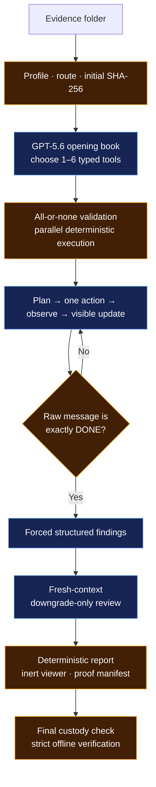

<p align="center">
  
</p>

<p align="center">
  <a href="LICENSE"></a>
  
  
  
  
  
</p>

<p align="center">
  <strong>A bounded autonomous DFIR investigator: model judgment where it helps,
  deterministic authority everywhere evidence can change.</strong>
</p>

<p align="center">
  <a href="#quickstart">Quickstart</a> ·
  <a href="#what-you-will-see">Run experience</a> ·
  <a href="#how-it-works">Architecture</a> ·
  <a href="#proof-status">Proof status</a> ·
  <a href="JUDGE-QUICKSTART.md">Judge guide</a>
</p>

Sentinel profiles an evidence folder, lets GPT-5.6 choose eligible read-only
typed tools, executes the opening in parallel, and follows with one auditable
action per adaptive turn. It then binds findings to exact retained output
bytes, asks a fresh-context reviewer to preserve or downgrade them, and seals a
deterministic report, inert viewer, custody receipts, and manifest into one
content-addressed proof bundle.

> **What “proves” means here:** code verifies what ran, what bytes were retained,
> what exact text was cited, and whether custody still matches. It does **not**
> prove that a model's forensic interpretation is true. A human analyst still
> owns that judgment.

## Current release status

| Capability | State |
|---|---|
| OpenAI-native controller and independent offline verifier | ✅ Verified offline |
| Linux/AMD64 Docker build, 274-test gate, CLI, profile, and custody | ✅ Verified locally |
| Cheap GPT-5.6 Luna typed-tool canary | ⏳ Implemented and mocked; authentic API receipt pending |
| Authentic completed GPT-5.6 Sol evidence bundle | ⏳ Pending authorized project key and case run |
| Same-evidence speed/cost/accuracy comparison with Qwen | ⏳ Benchmark contract ready; measurement pending |

The project is an engineering release candidate, not a claim that the final
hackathon evidence has already been produced. See the
[release handoff](docs/OPENAI_VNEXT_RELEASE_HANDOFF.md) for the full scorecard
and fastest submission path.

## Quickstart

Choose the smallest path that answers your question.

### 1. No key: prove the container and evidence front door work

Requirements: Git and Docker Desktop (or Docker Engine + Compose).

```powershell
git clone https://github.com/3sk1nt4n/sentinel-unchained.git
cd sentinel-unchained
docker compose build
docker compose run --rm offline --help
docker compose run --rm offline profile /evidence --json
```

The last command profiles the committed synthetic log fixture with **no
network**, **no API key**, and **zero OpenAI calls**. It should report
`logs-only`, public evidence ID `E001`, and matching custody.

To profile your own folder read-only:

```powershell
$env:SENTINEL_EVIDENCE_PATH = "C:\Evidence\CASE-A"
docker compose run --rm offline profile /evidence --json
```

### 2. Cheap live check: one GPT-5.6 Luna request

This canary tests only container → OpenAI authentication, the Responses API,
returned model/request identity, usage accounting, and one forced strict typed
tool call. It reads no evidence and creates no proof bundle.

Put the key in a one-line file outside the repository, then point Compose to
that file:

```powershell
$env:OPENAI_API_KEY_FILE = "C:\Secure\openai_api_key"
docker compose --profile live run --rm live-smoke
```

The key is mounted as a Docker secret and read through
`OPENAI_API_KEY_FILE`; it is not copied into the image or placed in ordinary
container environment metadata. The command defaults to `gpt-5.6-luna`, one
request, low reasoning, low verbosity, a 128-output-token ceiling, `store=false`,
and no retry layer.

> The result is labeled `NONQUALIFYING_CONNECTIVITY_SMOKE`. It cannot satisfy
> `--require-live-gpt56`, enter the Qwen benchmark, or stand in for a forensic
> run. Luna is used here because OpenAI positions it for efficient,
> high-volume work at lower cost; the proof-compatible investigation remains
> Sol-specific. See OpenAI's [latest-model guide](https://developers.openai.com/api/docs/guides/latest-model)
> and [current pricing](https://developers.openai.com/api/docs/pricing).

<details>
<summary>Linux/macOS secret-file command</summary>

```bash
export OPENAI_API_KEY_FILE=/secure/openai_api_key
docker compose --profile live run --rm live-smoke
```

</details>

### 3. Real investigation: GPT-5.6 Sol proof path

The flagship path is native Windows + CPython 3.11 for Windows memory evidence.
Use an authorized project key and the public `gpt-5.6` alias, which currently
routes to Sol.

```powershell
py -3.11 -m venv C:\venvs\sentinel-unchained
& C:\venvs\sentinel-unchained\Scripts\Activate.ps1
python -m pip install .

$env:UNCHAINED_MODEL = "gpt-5.6"
$env:OPENAI_API_KEY = "<set locally; never paste or commit it>"

sentinel doctor
sentinel profile C:\Evidence\CASE-A --json
sentinel run C:\Evidence\CASE-A --caps strict
```

At completion, the CLI prints the exact next `verify` and `view` commands.
Do not spend the real case until the Luna canary and a harmless synthetic Sol
lifecycle have passed.

## What you will see

1. **Case card** — evidence is classified by bounded content probes, assigned
   public IDs, routed by OS/shape, and SHA-256 hashed before any model call.
2. **Opening book** — GPT-5.6 chooses one to six eligible typed tools. Code
   validates the complete decision and starts valid calls concurrently.
3. **Visible investigation** — each adaptive turn is
   `PLAN → one ACT → OBSERVE → UPDATE`; growing provider transcripts are not
   replayed.
4. **Grounded review** — exact quotes become content-addressed UTF-8 byte spans;
   a fresh-context reviewer may preserve or downgrade, never upgrade.
5. **Proof handoff** — Sentinel prints the bundle path, terminal status, and
   exact verification/viewer commands.

The model never receives a shell, local evidence path, executable name,
subprocess authority, or budget authority. Fixed private workers may invoke
allowlisted forensic operations; the model cannot construct those commands.

## What you get

Every finalized run lives under
`unchained-runs/<UTC-timestamp>-<id>/` outside the evidence tree.

| Artifact | Plain-English purpose |
|---|---|
| `viewer.html` | Self-contained, no-JavaScript proof viewer; no server required |
| `report.md` | Human-readable report with deterministic finding rows and citations |
| `audit.jsonl` | Ordered, hash-chained lifecycle receipts |
| `tool-outputs/` | Exact sanitized outputs cited by findings |
| `profile.json` | Evidence inventory, route, readiness, and capability label |
| `environment.json` | Allowlisted runtime, dependency, model, prompt, catalog, and cap facts |
| `summary.json` | Audit-derived status, usage, finding, receipt, and custody counters |
| `manifest.json` + `manifest.sha256` | Content-addressed bundle inventory and detached checksum |

```powershell
sentinel view C:\path\to\bundle
```

`view` verifies the bundle before opening it. A bundle claiming `COMPLETE`
automatically receives strict lifecycle verification first.

## Why Sentinel is different

| Layer | Authority |
|---|---|
| GPT-5.6 investigator | Chooses bounded strategy, updates the visible ledger, interprets retained observations, proposes findings |
| Deterministic controller | Routes evidence, validates typed calls, enforces caps, executes tools, hashes custody, resolves exact spans |
| Fresh-context reviewer | Preserves or downgrades existing findings; cannot create or upgrade them |
| Deterministic renderer | Owns authoritative finding rows, transitions, citations, status, report, and viewer |
| Offline verifier | Reconstructs phase inputs, receipts, spans, costs, report, viewer, custody, and terminal state |
| Human analyst | Decides whether the interpretation is correct and what action to take |

That separation is the product: **GPT-5.6 decides where to look; deterministic
code controls what is legal and proves what the system actually retained and
cited.**

## How it works



- **Blue:** GPT-5.6 judgment inside a bounded protocol.
- **Amber:** deterministic code authority and proof reconstruction.

Read the full [architecture](docs/ARCHITECTURE.md) or the detailed
[OpenAI vNext review](docs/OPENAI_VNEXT_REVIEW.md).

## Proof status

| Claim | Current evidence |
|---|---|
| Deterministic profile, routing, public IDs, and pre/post custody | Unit/adversarial tests + containerized synthetic profile |
| One-to-six all-or-none parallel opening | Controller and synchronization-barrier regression tests |
| Stateless one-action adaptive loop and literal `DONE` | Exact-input and protocol mutation tests |
| Exact evidence spans | Full-artifact late-span and byte-mutation tests |
| Downgrade-only fresh review | Finding-ID, status-lattice, span, and receipt tests |
| Deterministic report and inert viewer | Independent rerender + exact-byte and positive HTML/CSP policy tests |
| Independent strict verifier | Re-chained adversarial mutations across lifecycle, usage, retry, cost, and custody |
| Linux Docker packaging | CPython 3.11 test target: 274 tests, Ruff, format, and `pip check`; non-root runtime/profile gate |
| Live GPT-5.6 Luna canary | Pending an authorized key; no live receipt is claimed |
| Authentic complete GPT-5.6 Sol case | Pending |
| Faster/better than Qwen | Architectural thesis only until the frozen benchmark is run |

The verifier establishes local protocol and bundle consistency. It does not
cryptographically authenticate OpenAI, replace semantic accuracy scoring, or
turn a same-family reviewer into external ground truth.

## Inspect a proof bundle without a key

```powershell
sentinel verify C:\path\to\bundle --require-complete --require-live-gpt56
sentinel view C:\path\to\bundle
```

Strict verification does more than recompute manifest hashes:

- it reconstructs every model-visible phase packet and typed-call contract;
- it resolves finding quotes against retained artifacts and exact UTF-8 ranges;
- it recomputes usage, local cost estimates, lifecycle counts, and custody;
- it rebuilds `report.md` and `viewer.html` and requires byte-for-byte equality.

Offline consistency is not provider authenticity. Preserve provider-side logs
and externally anchor the final checksum if that threat model matters.

## Supported paths

| Evidence / host route | Status |
|---|---|
| Windows memory image on native Windows | Flagship substrate demonstrated; authentic vNext case pending |
| Raw memory image in the safe Linux container | Supported by Volatility; case-specific symbols/readiness still apply |
| Raw disk image with Sleuth Kit in the safe container | Unprivileged raw inspection available |
| Mounted E01/NTFS/APFS inside Docker | Not enabled; would require elevated device/FUSE authority |
| Windows disk/E01 on a properly configured native host | Implemented; authentic vNext route pending |
| Linux evidence | Experimental |
| macOS evidence | Best effort |
| Logs-only folder | Profile/custody smoke only; not a complete investigation route |
| Two ready memory images or two ready disk images | Fails closed; split them into separate cases |

Evidence capability is route-specific. “Docker runs on this laptop” is not the
same claim as “every forensic image type is fully supported on this host.”

## Docker safety boundary

The default Compose service is intentionally conservative:

- non-root UID/GID `10001:10001`;
- read-only root filesystem and read-only evidence bind;
- all Linux capabilities dropped;
- `no-new-privileges` and bounded process count;
- no Docker socket, host PID namespace, or privileged mode;
- no network for the offline service;
- Git exists only in the networked builder, not the final runtime;
- `sleuthkit`, Volatility, CA certificates, and Tini in the runtime.

The live canary necessarily has outbound network access. Safe Docker mode does
not mount filesystems: E01/FUSE/loop-device support would weaken isolation and
is deliberately outside this default.

For multi-gigabyte evidence on Docker Desktop, use a local non-OneDrive path or
WSL2 ext4 storage. A cloud-synced bind can dominate runtime.

## CLI at a glance

```text
sentinel doctor
sentinel profile <evidence> --json
sentinel smoke-openai --json
sentinel run <evidence> --caps strict
sentinel verify <bundle> --require-complete --require-live-gpt56
sentinel view <bundle>
```

| Exit | Meaning |
|---:|---|
| `0` | Command completed within its policy; not an accuracy guarantee |
| `1` | Fatal runtime, provider, verification, or custody failure |
| `2` | Invalid input or configuration |
| `3` | `PARTIAL`: a cap or mandatory phase failed safely |

## Troubleshooting

| Symptom | What to do |
|---|---|
| `doctor` says model/key missing | Set `UNCHAINED_MODEL=gpt-5.6` and either `OPENAI_API_KEY` or `OPENAI_API_KEY_FILE` |
| Docker `doctor` exits `2` with no key | Expected for the offline/no-secret service; use `profile` or `--help` for the no-key gate |
| Luna smoke cannot find its secret | Set host `OPENAI_API_KEY_FILE` to a readable one-line file and add `--profile live` |
| Profile says mount unavailable | Use raw inspection or a properly configured native forensic host; do not add `--privileged` casually |
| Multiple same-class images fail | Put each ready memory/disk image in a separate case folder |
| `view` cannot open from Docker | Verify in the container, then open the bind-mounted `viewer.html` on the host |
| A run is `PARTIAL` | Read `summary.json`, `report.md`, and the last audit events; do not relabel it complete |

## Honest limits

- No authentic completed GPT-5.6 vNext evidence bundle is published yet.
- No frozen same-evidence Qwen latency/cost/accuracy benchmark is published yet.
- Exact receipts establish execution and citation support, not forensic truth.
- The fresh reviewer is a same-family model call, not independent ground truth.
- Private worker containment and process-tree cleanup are not a complete OS sandbox.
- SHA-256 pre/post checks do not defeat every privileged concurrent pathname race.
- A privileged actor who can rewrite and reseal the whole local bundle is outside
  the current trust boundary; signed/timestamped external anchoring is future work.

## Documentation map

| Read this | When |
|---|---|
| [Judge quickstart](JUDGE-QUICKSTART.md) | First judge walkthrough or native setup |
| [OpenAI vNext release handoff](docs/OPENAI_VNEXT_RELEASE_HANDOFF.md) | Completed jobs, comparison, Docker gate, winning story, demo, and next actions |
| [Architecture](docs/ARCHITECTURE.md) | Trust boundary and lifecycle design |
| [OpenAI vNext review](docs/OPENAI_VNEXT_REVIEW.md) | Baseline comparison and defect disposition |
| [Hackathon handover](HACKATHON_HANDOVER.md) | Current proof ledger and execution checklist |
| [Winner roadmap](docs/WINNER_ROADMAP.md) | Scoring strategy and benchmark plan |
| [Build provenance](BUILD_PROVENANCE.md) | Submission-period contribution boundary |
| [Decisions](DECISIONS.md) | Detailed protocol and scope decisions |

## Development

Native CPython 3.11 gate:

```powershell
python -m pip check
python -m pytest -q
python -m ruff check .
python -m ruff format --check .
python -m build
```

Clean Linux/AMD64 Docker gate:

```powershell
docker build --target test -t sentinel-unchained:test .
docker build --target runtime -t sentinel-unchained:local .
docker compose run --rm offline profile /evidence --json
```

The package requires CPython `>=3.11,<3.12`. The Qwen reference-tool dependency
is pinned to commit
`9f309c6134e857f7b86f3e6b9c6709ce954944a5`; Docker resolves it only in the
builder and installs the final image from prebuilt wheels.

## Provenance and license

Sentinel Unchained is an MIT-licensed OpenAI Build Week project by Adil Eskintan.
It was built from the reviewed Sentinel Unchained baseline while retaining
selected, commit-pinned typed forensic tooling from
[Sentinel Qwen Ensemble](https://github.com/3sk1nt4n/Sentinel-Ensemble-Qwen).

The contribution boundary and preserved pre-event Git provenance are documented
in [BUILD_PROVENANCE.md](BUILD_PROVENANCE.md). Detailed current work, validation,
and remaining claims are in the
[release handoff](docs/OPENAI_VNEXT_RELEASE_HANDOFF.md).

> **Winning line:** Sentinel is not an LLM pretending to be evidence. It is
> GPT-5.6 directing a bounded investigation whose actions, citations, custody,
> and final report can be checked independently.
